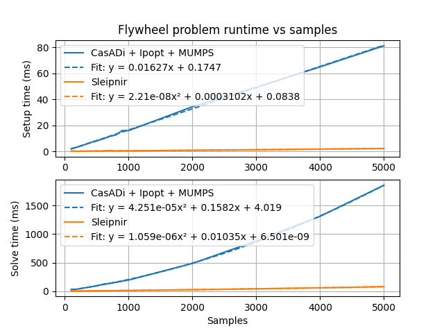

# Sleipnir


[](https://pypi.org/project/sleipnirgroup-jormungandr/)
[](https://sleipnirgroup.github.io/Sleipnir/)
[](https://sleipnirgroup.github.io/Sleipnir/docs/cpp)
[](https://sleipnirgroup.github.io/Sleipnir/docs/py)
[](https://discord.gg/ad2EEZZwsS)

> Sparsity and Linearity-Exploiting Interior-Point solver - Now Internally Readable

Named after Odin's eight-legged horse from Norse mythology, Sleipnir is a linearity-exploiting sparse nonlinear constrained optimization problem solver that uses the interior-point method.

```cpp
#include <print>

#include <sleipnir/optimization/problem.hpp>

int main() {
  // Find the x, y pair with the largest product for which x + 3y = 36
  slp::Problem problem;

  auto x = problem.decision_variable();
  auto y = problem.decision_variable();

  problem.maximize(x * y);
  problem.subject_to(x + 3 * y == 36);
  problem.solve();

  // x = 18.0, y = 6.0
  std::println("x = {}, y = {}", x.value(), y.value());
}
```

```python
#!/usr/bin/env python3

from jormungandr.optimization import Problem


def main():
    # Find the x, y pair with the largest product for which x + 3y = 36
    problem = Problem()

    x = problem.decision_variable()
    y = problem.decision_variable()

    problem.maximize(x * y)
    problem.subject_to(x + 3 * y == 36)
    problem.solve()

    # x = 18.0, y = 6.0
    print(f"x = {x.value()}, y = {y.value()}")


if __name__ == "__main__":
    main()
```

Sleipnir's internals are intended to be readable by those who aren't domain experts with links to explanatory material for its algorithms.

## Benchmarks

<table><tr>
  <td></td>
  <td></td>
</tr><tr>
  <td>
    <a href="flywheel-scalability-results-casadi.csv">
      flywheel-scalability-results-casadi.csv
    </a><br>
    <a href="flywheel-scalability-results-sleipnir.csv">
      flywheel-scalability-results-sleipnir.csv
    </a>
  </td>
  <td>
    <a href="cart-pole-scalability-results-casadi.csv">
      cart-pole-scalability-results-casadi.csv
    </a><br>
    <a href="cart-pole-scalability-results-sleipnir.csv">
      cart-pole-scalability-results-sleipnir.csv
    </a>
  </td>
</tr></table>

Generated by [tools/generate-scalability-results.sh](https://github.com/SleipnirGroup/Sleipnir/tree/main/tools/generate-scalability-results.sh) from [benchmarks/scalability](https://github.com/SleipnirGroup/Sleipnir/tree/main/benchmarks/scalability) source.

* CPU: AMD Ryzen 7 7840U
* RAM: 64 GB, 5600 MHz DDR5
* Compiler version: g++ (GCC) 14.2.1 20240805

The following thirdparty software was used in the benchmarks:

* CasADi 3.6.7 (autodiff and NLP solver frontend)
* Ipopt 3.14.17 (NLP solver backend)
* MUMPS 5.7.3 (linear solver)

Ipopt uses MUMPS by default because it has free licensing. Commercial linear solvers may be much faster.

See [benchmark details](https://github.com/SleipnirGroup/Sleipnir/?tab=readme-ov-file#benchmark-details) for more.

## Install

### Minimum system requirements

Sleipnir requires somewhat newer operating systems and C++ runtimes for std::print().

* Windows
  * OS: Windows 10
  * Runtime: [Microsoft Visual C++ 2022 redistributable](https://learn.microsoft.com/en-us/cpp/windows/latest-supported-vc-redist?view=msvc-170)
* Linux
  * OS: Ubuntu 24.04
  * Runtime: GCC 14 libstdc++ (run `sudo apt install g++-14`)
* macOS
  * OS: macOS 14
  * Runtime: Apple Clang 15.0.0 libc++ from Xcode 15.3 (run `xcode-select --install`)

### C++ library

To install Sleipnir system-wide, see the [build instructions](https://github.com/SleipnirGroup/Sleipnir/?tab=readme-ov-file#c-library-1).

To use Sleipnir within a CMake project, add the following to your CMakeLists.txt:
```cmake
include(FetchContent)

fetchcontent_declare(
    Sleipnir
    GIT_REPOSITORY https://github.com/SleipnirGroup/Sleipnir
    GIT_TAG main
)
fetchcontent_makeavailable(Sleipnir)

target_link_libraries(MyApp PUBLIC Sleipnir)
```

### Python library

```bash
pip install sleipnirgroup-jormungandr
```

## API docs

See the [C++ API docs](https://sleipnirgroup.github.io/Sleipnir/docs/cpp) and [Python API docs](https://sleipnirgroup.github.io/Sleipnir/docs/py).

## Examples

See the [examples](https://github.com/SleipnirGroup/Sleipnir/tree/main/examples), [C++ optimization unit tests](https://github.com/SleipnirGroup/Sleipnir/tree/main/test/optimization), and [Python optimization unit tests](https://github.com/SleipnirGroup/Sleipnir/tree/main/jormungandr/test/optimization).

## Build

### Dependencies

* C++23 compiler
  * On Windows 10 or greater, install [Visual Studio Community 2022](https://visualstudio.microsoft.com/vs/community/) and select the C++ programming language during installation
  * On Ubuntu 24.04 or greater, install GCC 14 via `sudo apt install g++-14`
  * On macOS 14 or greater, install the Xcode 15.3 command-line build tools via `xcode-select --install`
* [CMake](https://cmake.org/download/) 3.21 or greater
  * On Windows, install from the link above
  * On Linux, install via `sudo apt install cmake`
  * On macOS, install via `brew install cmake`
* [Python](https://www.python.org/downloads/) 3.9 or greater
  * On Windows, install from the link above
  * On Linux, install via `sudo apt install python`
  * On macOS, install via `brew install python`
* [Eigen](https://gitlab.com/libeigen/eigen)
* [nanobind](https://github.com/wjakob/nanobind) (build only)
* [Catch2](https://github.com/catchorg/Catch2) (tests only)

Library dependencies which aren't installed locally will be automatically downloaded and built by CMake.

The benchmark executables require [CasADi](https://github.com/casadi/casadi) to be installed locally.

### C++ library

On Windows, open a [Developer PowerShell](https://learn.microsoft.com/en-us/visualstudio/ide/reference/command-prompt-powershell?view=vs-2022). On Linux or macOS, open a Bash shell.

```bash
# Clone the repository
git clone git@github.com:SleipnirGroup/Sleipnir
cd Sleipnir

# Configure; automatically downloads library dependencies
cmake -B build -S .

# Build
cmake --build build

# Test
ctest --test-dir build --output-on-failure

# Install
cmake --install build --prefix pkgdir
```

The following build types can be specified via `-DCMAKE_BUILD_TYPE` during CMake configure:

* Debug
  * Optimizations off
  * Debug symbols on
* Release
  * Optimizations on
  * Debug symbols off
* RelWithDebInfo (default)
  * Release build type, but with debug info
* MinSizeRel
  * Minimum size release build
* Asan
  * Enables address sanitizer
* Tsan
  * Enables thread sanitizer
* Ubsan
  * Enables undefined behavior sanitizer
* Perf
  * RelWithDebInfo build type, but with frame pointer so perf utility can use it

### Python library

On Windows, open a [Developer PowerShell](https://learn.microsoft.com/en-us/visualstudio/ide/reference/command-prompt-powershell?view=vs-2022). On Linux or macOS, open a Bash shell.

```bash
# Clone the repository
git clone git@github.com:SleipnirGroup/Sleipnir
cd Sleipnir

# Setup
pip install --user build

# Build
python -m build --wheel

# Install
pip install --user dist/sleipnirgroup_jormungandr-*.whl

# Test
pytest
```

## Test diagnostics

Passing the `--enable-diagnostics` flag to the test executable enables solver diagnostic prints.

Some test problems generate CSV files containing their solutions. These can be plotted with [tools/plot_test_problem_solutions.py](https://github.com/SleipnirGroup/Sleipnir/blob/main/tools/plot_test_problem_solutions.py).

## Benchmark details

### Running the benchmarks

Benchmark projects are in the [benchmarks folder](https://github.com/SleipnirGroup/Sleipnir/tree/main/benchmarks). To compile and run them, run the following in the repository root:
```bash
# Install CasADi and [matplotlib, numpy, scipy] pip packages first
cmake -B build -S . -DBUILD_BENCHMARKS=ON
cmake --build build
./tools/generate-scalability-results.sh
```

See the contents of `./tools/generate-scalability-results.sh` for how to run specific benchmarks.

### How we improved performance

#### Make more decisions at compile time

During problem setup, equality and inequality constraints are encoded as different types, so the appropriate setup behavior can be selected at compile time via operator overloads.

#### Reuse autodiff computation results that are still valid (aka caching)

The autodiff library automatically records the linearity of every node in the computational graph. Linear functions have constant first derivatives, and quadratic functions have constant second derivatives. The constant derivatives are computed in the initialization phase and reused for all solver iterations. Only nonlinear parts of the computational graph are recomputed during each solver iteration.

For quadratic problems, we compute the Lagrangian Hessian and constraint Jacobians once with no problem structure hints from the user.

#### Use a performant linear algebra library with fast sparse solvers

[Eigen](https://gitlab.com/libeigen/eigen/) provides these. It also has no required dependencies, which makes cross compilation much easier.

#### Use a pool allocator for autodiff expression nodes

This promotes fast allocation/deallocation and good memory locality.

We could mitigate the solver's high last-level-cache miss rate (~42% on the machine above) further by breaking apart the expression nodes into fields that are commonly iterated together. We used to use a tape, which gave computational graph updates linear access patterns, but tapes are monotonic buffers with no way to reclaim storage.
