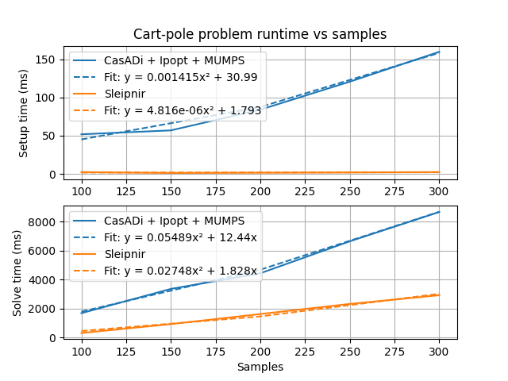

# Sleipnir


[](https://sleipnirgroup.github.io/Sleipnir/)
[](https://discord.gg/ad2EEZZwsS)

> Sparsity and Linearity-Exploiting Interior-Point solver - Now Internally Readable

Named after Odin's eight-legged horse from Norse mythology, Sleipnir is a linearity-exploiting sparse nonlinear constrained optimization problem solver that uses the interior-point method.

Sleipnir's internals are intended to be readable by those who aren't domain experts, unlike other optimization problem solvers.

## Benchmarks

<table><tr>
  <td></td>
  <td></td>
</tr></table>

Generated by [tools/generate-scalability-results.sh](https://github.com/SleipnirGroup/Sleipnir/tree/main/tools/generate-scalability-results.sh) from [benchmarks/scalability](https://github.com/SleipnirGroup/Sleipnir/tree/main/benchmarks/scalability) source on a i5-8350U with 16 GB RAM.

Benchmark projects are in the [benchmarks folder](https://github.com/SleipnirGroup/Sleipnir/tree/main/benchmarks). To compile and run the flywheel scalability benchmark, run the following in the repository root:
```bash
# Install CasADi first
cmake -B build -S .
cmake --build build
./build/FlywheelScalabilityBenchmark

# Install matplotlib, numpy, and scipy pip packages first
./tools/plot_scalability_results.py --filename flywheel-scalability-results.csv --title Flywheel
```

## Examples

See the [examples](https://github.com/SleipnirGroup/Sleipnir/tree/main/examples) and [optimization unit tests](https://github.com/SleipnirGroup/Sleipnir/tree/main/test/optimization).

## Dependencies

* C++20 compiler
  * On Linux, install GCC 11 or greater
  * On Windows, install [Visual Studio Community 2022](https://visualstudio.microsoft.com/vs/community/) and select the C++ programming language during installation
  * On macOS, install the Xcode command-line build tools via `xcode-select --install`
* [Eigen](https://gitlab.com/libeigen/eigen)
* [fmtlib](https://github.com/fmtlib/fmt) (internal only)
* [googletest](https://github.com/google/googletest) (tests only)

Library dependencies which aren't installed locally will be automatically downloaded and built by CMake.

If [CasADi](https://github.com/casadi/casadi) is installed locally, the benchmark executables will be built.

## Build instructions

Starting from the repository root, run the configure step:
```bash
cmake -B build -S .
```

This will automatically download library dependencies.

Run the build step:
```bash
cmake --build build
```

Run the tests:
```bash
cd build
ctest
```

### Supported build types

The following build types can be specified via `-DCMAKE_BUILD_TYPE`:

* Debug
  * Optimizations off
  * Debug symbols on
* Release
  * Optimizations on
  * Debug symbols off
* RelWithDebInfo (default)
  * Release build type, but with debug info
* MinSizeRel
  * Minimum size release build
* Asan
  * Enables address sanitizer
* Tsan
  * Enables thread sanitizer
* Ubsan
  * Enables undefined behavior sanitizer
* Perf
  * RelWithDebInfo build type, but with frame pointer so perf utility can use it

## Test problem solutions

Some test problems generate CSV files containing their solutions. These can be plotted with [tools/plot_test_problem_solutions.py](https://github.com/SleipnirGroup/Sleipnir/blob/main/tools/plot_test_problem_solutions.py).

## Logo

Logo: [SVG](https://github.com/SleipnirGroup/Sleipnir/tree/main/logo/sleipnir.svg), [PNG (1000px)](https://github.com/SleipnirGroup/Sleipnir/tree/main/logo/sleipnir_THcolors_1000px.png)<br>
Font: [Centaur](https://en.wikipedia.org/wiki/Centaur_(typeface))
