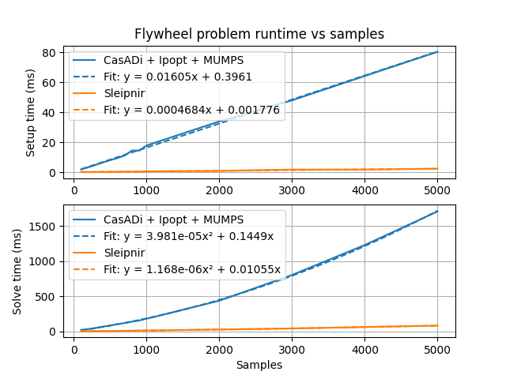
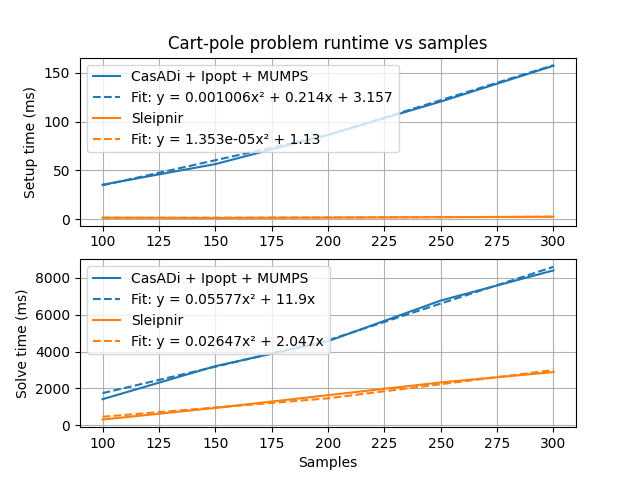

# Benchmarks

<table><tr>
  <td></td>
  <td></td>
</tr><tr>
  <td>
    <a href="flywheel-scalability-results-casadi.csv">
      flywheel-scalability-results-casadi.csv
    </a><br>
    <a href="flywheel-scalability-results-sleipnir.csv">
      flywheel-scalability-results-sleipnir.csv
    </a>
  </td>
  <td>
    <a href="cart-pole-scalability-results-casadi.csv">
      cart-pole-scalability-results-casadi.csv
    </a><br>
    <a href="cart-pole-scalability-results-sleipnir.csv">
      cart-pole-scalability-results-sleipnir.csv
    </a>
  </td>
</tr></table>

Generated by [benchmarks/generate-scalability-results.sh](https://github.com/SleipnirGroup/Sleipnir/tree/main/benchmarks/generate-scalability-results.sh) from [benchmarks/scalability](https://github.com/SleipnirGroup/Sleipnir/tree/main/benchmarks/scalability) source.

* CPU: AMD Ryzen 7 7840U
* RAM: 64 GB, 5600 MHz DDR5
* Compiler version: g++ (GCC) 15.2.1 20250813

The following thirdparty software was used in the benchmarks:

* CasADi 3.7.2 (autodiff and NLP solver frontend)
* Ipopt 3.14.19 (NLP solver backend)
* MUMPS 5.7.3 (linear solver)

Ipopt uses MUMPS by default because it has free licensing. Commercial linear solvers may be much faster.

## Running the benchmarks

Benchmark projects are in the [benchmarks folder](https://github.com/SleipnirGroup/Sleipnir/tree/main/benchmarks). To compile and run them, run the following in the repository root:
```bash
# Install CasADi and [matplotlib, numpy, scipy] pip packages first
cmake -B build -S . -DBUILD_BENCHMARKS=ON
cmake --build build
./tools/generate-scalability-results.sh
```

See the contents of `./tools/generate-scalability-results.sh` for how to run specific benchmarks.

## How we improved performance

### Make more decisions at compile time

During problem setup, equality and inequality constraints are encoded as different types, so the appropriate setup behavior can be selected at compile time via operator overloads.

### Reuse autodiff computation results that are still valid (aka caching)

The autodiff library automatically records the linearity of every node in the computational graph. Linear functions have constant first derivatives, and quadratic functions have constant second derivatives. The constant derivatives are computed in the initialization phase and reused for all solver iterations. Only nonlinear parts of the computational graph are recomputed during each solver iteration.

For quadratic problems, we compute the Lagrangian Hessian and constraint Jacobians once with no problem structure hints from the user.

### Use a performant linear algebra library with fast sparse solvers

[Eigen](https://gitlab.com/libeigen/eigen) provides these. It also has no required dependencies, which makes cross compilation much easier.

### Use a pool allocator for autodiff expression nodes

This promotes fast allocation/deallocation and good memory locality.

We could mitigate the solver's high last-level-cache miss rate (~42% on the machine above) further by breaking apart the expression nodes into fields that are commonly iterated together. We used to use a tape, which gave computational graph updates linear access patterns, but tapes are monotonic buffers with no way to reclaim storage.
